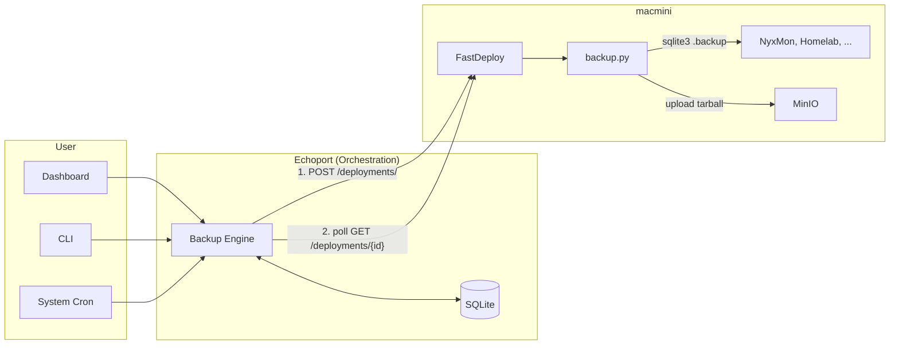
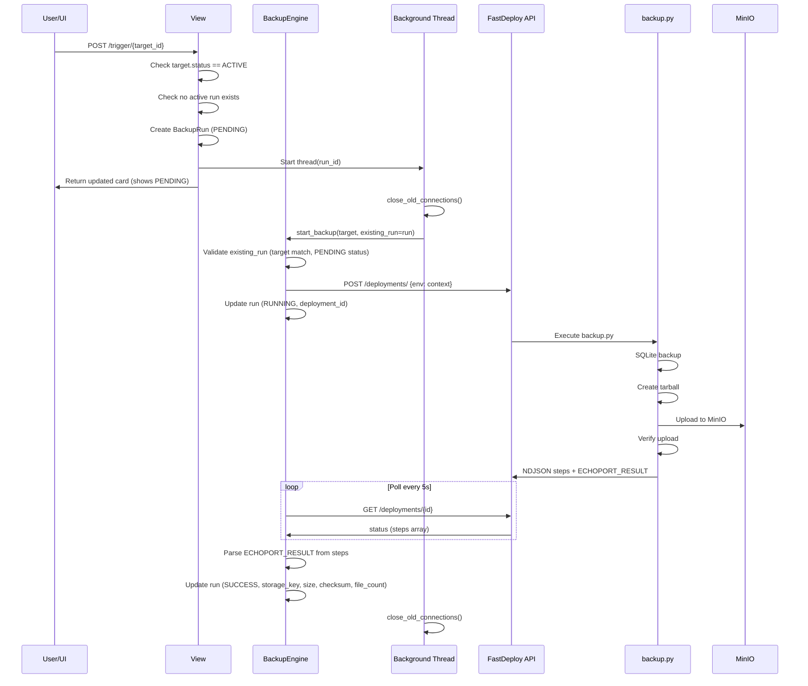

# Echoport - Backup Service PRD

**Status**: v1.5 (Restore Working)
**Date**: 2026-01-27
**Last Updated**: 2026-01-29 (Phase 3 complete: restore tested and working)

---

## Vision

Echoport is a backup orchestration service that:
1. Manages backups for homelab services (initially just Jochen)
2. Stores backups in MinIO (S3-compatible)
3. Integrates with FastDeploy for execution on remote hosts
4. Provides a simple dashboard for backup status and restore operations

---

## First Target: NyxMon

**Why NyxMon?**
- Simple backup needs (SQLite database)
- Django app (familiar stack)
- Already deployed via FastDeploy pattern

**What to back up:**
- `/home/nyxmon/site/db.sqlite3` - The database (critical)
- **Note**: `.env` file is NOT backed up (contains secrets). On restore, manually run `just deploy-one nyxmon` from ops-control to regenerate `.env` from secrets.

**Backup strategy:**
- **Safe SQLite backup**: Use `sqlite3 db.sqlite3 ".backup /tmp/backup.db"` (not file copy - avoids corruption on live DB)
- **Artifact format**: Single `.tar.gz` containing all backup files + `manifest.json`
- Store in MinIO with timestamp: `backups/nyxmon/20260127T020000.tar.gz`
- Retain: 7 daily, 4 weekly, 12 monthly (enforced by Echoport in Phase 4)

---

## Architecture Overview

**Key insight**: FastDeploy is the execution layer, Echoport is the orchestration layer.



**Why this split?**
1. FastDeploy already runs on macmini with subprocess execution infrastructure
2. Backup scripts run locally on the server (fast, direct MinIO access)
3. Echoport handles backup-specific concerns (scheduling, retention, restore UI)
4. Future multi-tenant needs (external users interact with Echoport, not FastDeploy)

**Integration flow:**
1. User clicks "Backup Now" or cron triggers scheduled backup
2. Echoport creates BackupRun (status=pending), DB constraint prevents concurrent backups
3. Echoport calls FastDeploy API: `POST /deployments/` with context `{ECHOPORT_TARGET: "nyxmon", ECHOPORT_DB_PATH: "/home/nyxmon/site/db.sqlite3"}`
4. FastDeploy runs `backup.py` on macmini
5. Script: safe SQLite backup → tarball with manifest → MinIO upload
6. Echoport polls `GET /deployments/{id}` every 5s until finished (timeout: 10min)
7. Echoport parses ECHOPORT_RESULT from step messages, updates BackupRun
8. Lock automatically released when run status changes from pending/running

**Note**: Retention cleanup runs separately in Phase 4 (not part of backup flow).

---

## Tech Stack (Decided)

| Component | Choice | Rationale |
|-----------|--------|-----------|
| **Backend** | Python/Django | Familiar, matches other projects |
| **Frontend** | HTMX + Django templates | Simple, proven in homelab |
| **Database** | SQLite (initially) | Simple, can migrate to PG later |
| **Storage** | MinIO (S3 API) | Already running, proven |
| **Scheduler** | System cron + Django management command | Simpler than APScheduler, avoids multi-worker issues with SQLite |
| **Execution** | FastDeploy API | Reuses existing infra, scripts run locally |
| **HTTP Client** | httpx (sync) | Simple, well-maintained |

**Scheduler note**: APScheduler with SQLite can have issues with multiple workers and job state persistence. Using system cron to call `python manage.py run_scheduled_backups` is simpler and more reliable for MVP. Can revisit with Celery+Redis if needed later.

**Scheduling deferred to Phase 2** - Phase 1 only supports manual backups via UI and CLI.

---

## Implementation Details (Phase 1)

### Key Design Decisions

| Decision | Rationale |
|----------|-----------|
| **Fully synchronous engine** | Avoids Django's `SynchronousOnlyOperation` error when mixing async/ORM. Background threads handle concurrency. |
| **ECHOPORT_RESULT in step message** | FastDeploy only parses valid JSON lines. Raw `ECHOPORT_RESULT:{json}` would be dropped. Embedding in step message ensures delivery. |
| **Minimal result payload** | FastDeploy truncates step messages at 4KB. Send only essential metadata (bucket, key, size, checksum, file_count). Full manifest stored in tarball. |
| **Root-owned service files** | Prevents privilege escalation. Fastdeploy user can execute but not modify script/config. |
| **Run created synchronously in view** | Avoids UI race condition where background thread hasn't created DB record before view queries it. |
| **existing_run parameter** | `start_backup(target, existing_run=run)` allows view to create run, thread to continue it. Single implementation, no duplication. |
| **close_old_connections()** | Background threads must manage DB connections explicitly to avoid leaks. |
| **All views require @login_required** | Prevents unauthorized access to dashboard and backup triggers. |
| **Restore requires @staff_member_required** | Restore is destructive - limits to admin users. |
| **Cross-lock backup/restore** | Uses `select_for_update` on PostgreSQL to prevent backup during restore and vice versa. Falls back to constraint-based protection on SQLite. |
| **Checksum required for restore** | Prevents restoring from backups without integrity verification. |
| **Safe tarball extraction** | Rejects path traversal, symlinks outside dest, device nodes, FIFOs. Prevents malicious archive attacks. |
| **Fail on missing ECHOPORT_RESULT (restore)** | Unlike backup, restore with no result is treated as failure - avoids hiding partial restores. |
| **Pre-created runs marked failed** | If preconditions fail after UI creates PENDING run, run is marked FAILED before exception raised. |
| **FastDeploy stdout drain fix** | FastDeploy had a race condition where it checked `proc.returncode` after `readline()` but before processing data, discarding output when subprocess exited quickly. Fixed by removing the premature exit check - loop now exits only on EOF. |

### Where Things Live (Phase 1)

| Component | Location | Purpose |
|-----------|----------|---------|
| **Backup role** | `ops-library/roles/echoport_backup/` | Ansible role that registers backup service with FastDeploy |
| **Backup script** | Deployed to `fastdeploy/services/echoport-backup/backup.py` via role | Self-contained backup logic |
| **Service config** | Deployed to `fastdeploy/services/echoport-backup/config.json` via role | FastDeploy service definition |
| **MinIO credentials** | Configured via role variables, mc alias on macmini | `echoport_backup_minio_*` vars |
| **Echoport** | `echoport/` Django app | Scheduling, history, UI, FastDeploy API client |
| **Deploy role** | `ops-library/roles/echoport_deploy/` | Ansible role for deploying Echoport itself |
| **Deploy playbook** | `ops-control/playbooks/deploy-echoport.yml` | Playbook with secrets and config |

**Security hardening (ops-library role):**
- Directory, script, and config.json all owned by `root:root`
- Script mode `0755` (readable/executable by all, writable only by root)
- Two-stage sudo chain: `fastdeploy→deploy→root` (FastDeploy pattern)
- Sudoers uses `NOPASSWD:NOSETENV` to prevent environment manipulation
- Path allowlist validation (`/home/`, `/opt/`, `/var/lib/`) prevents file exfiltration
- Symlink validation at all levels (top-level and nested via copytree ignore callback)
- Database file existence check prevents sqlite3 creating empty DBs
- Fail-fast when running as root without config file

### Backup Script Output

The backup script emits progress via NDJSON to stdout:

```json
{"name": "init", "state": "running", "message": "Starting backup"}
{"name": "init", "state": "success", "message": "Configuration loaded for nyxmon"}
{"name": "backup", "state": "running", "message": "Creating backup"}
{"name": "backup", "state": "success", "message": "Backup created (2 files)"}
{"name": "upload", "state": "running", "message": "Creating archive and uploading"}
{"name": "upload", "state": "success", "message": "Uploaded 45,231 bytes"}
{"name": "verify", "state": "running", "message": "Verifying upload"}
{"name": "verify", "state": "success", "message": "Backup verified in MinIO"}
{"name": "result", "state": "success", "message": "ECHOPORT_RESULT:{\"success\":true,\"bucket\":\"backups\",\"key\":\"nyxmon/2026-01-28T02-00-00.tar.gz\",\"size_bytes\":45231,\"checksum_sha256\":\"abc123...\",\"file_count\":2}"}
{"event": "finish", "status": "success", "message": "Backup completed: backups/nyxmon/2026-01-28T02-00-00.tar.gz"}
```

**Note**: ECHOPORT_RESULT is embedded in the `result` step's message field. This ensures FastDeploy captures it (only valid JSON lines are parsed). The payload is kept small (~200 bytes) to avoid the 4KB message truncation limit.

### Backup Flow (Sequence)



---

## Data Model (Implemented)

```python
class BackupTarget(models.Model):
    """Source of truth for backup configuration."""

    name = models.CharField(max_length=100, unique=True)
    description = models.TextField(blank=True)
    icon = models.CharField(max_length=50, blank=True)  # Emoji for dashboard display
    fastdeploy_service = models.CharField(max_length=100)

    # What to back up
    db_path = models.CharField(max_length=500, blank=True)
    backup_files = models.JSONField(default=list, blank=True)

    # Scheduling (Phase 2)
    schedule = models.CharField(max_length=100, blank=True)  # Cron expression

    # Restore (Phase 3)
    service_name = models.CharField(max_length=100, blank=True)  # Systemd service to stop/start during restore

    # Status
    status = models.CharField(max_length=20, choices=BackupStatus.choices, default="active")
    retention_days = models.PositiveIntegerField(default=30)
    timeout_seconds = models.PositiveIntegerField(default=600)

    # Storage
    storage_bucket = models.CharField(max_length=100, default="backups")


class BackupRun(models.Model):
    """Individual backup execution record."""

    target = models.ForeignKey(BackupTarget, on_delete=models.CASCADE, related_name="runs")
    status = models.CharField(max_length=20, choices=BackupRunStatus.choices, default="pending")
    trigger = models.CharField(max_length=20, choices=BackupTrigger.choices, default="manual")
    triggered_by = models.CharField(max_length=100, blank=True)

    # FastDeploy tracking
    fastdeploy_deployment_id = models.PositiveIntegerField(null=True, blank=True)

    # Result data
    storage_bucket = models.CharField(max_length=100, blank=True)
    storage_key = models.CharField(max_length=500, blank=True)
    size_bytes = models.BigIntegerField(null=True, blank=True)
    checksum_sha256 = models.CharField(max_length=64, blank=True)
    file_count = models.PositiveIntegerField(null=True, blank=True)

    # Error tracking
    error_message = models.TextField(blank=True)
    logs = models.TextField(blank=True)

    # Timestamps
    started_at = models.DateTimeField(default=timezone.now)
    finished_at = models.DateTimeField(null=True, blank=True)

    class Meta:
        ordering = ["-started_at"]
        constraints = [
            # Prevent concurrent backups for the same target
            models.UniqueConstraint(
                fields=["target"],
                condition=models.Q(status__in=["pending", "running"]),
                name="unique_active_backup_per_target",
            )
        ]


class RestoreRun(models.Model):
    """Individual restore execution record (Phase 3)."""

    backup_run = models.ForeignKey(BackupRun, on_delete=models.PROTECT, related_name="restores")
    target = models.ForeignKey(BackupTarget, on_delete=models.CASCADE, related_name="restore_runs")
    status = models.CharField(max_length=20, choices=RestoreRunStatus.choices, default="pending")
    trigger = models.CharField(max_length=20, choices=RestoreTrigger.choices, default="manual")
    triggered_by = models.CharField(max_length=100, blank=True)

    # FastDeploy tracking
    fastdeploy_deployment_id = models.PositiveIntegerField(null=True, blank=True)

    # Result data
    files_restored = models.PositiveIntegerField(null=True, blank=True)

    # Error tracking
    error_message = models.TextField(blank=True)
    logs = models.TextField(blank=True)

    # Timestamps
    started_at = models.DateTimeField(default=timezone.now)
    finished_at = models.DateTimeField(null=True, blank=True)

    class Meta:
        ordering = ["-started_at"]
        constraints = [
            # Prevent concurrent restores for the same target
            models.UniqueConstraint(
                fields=["target"],
                condition=models.Q(status__in=["pending", "running"]),
                name="unique_active_restore_per_target",
            )
        ]
```

---

## MVP Scope

### Phase 1: Manual Backup ✅ COMPLETE

**ops-library (deployed to macmini via ops-control):**
- [x] Create `roles/echoport_backup/` Ansible role
- [x] Role deploys `backup.py` script to FastDeploy services directory
- [x] Role deploys `config.json` for FastDeploy service registration
- [x] Role configures MinIO credentials via mc alias
- [x] Security hardening: root ownership, NOSETENV, path allowlist, symlink validation
- [x] Deployed via `just register-echoport-backup` in ops-control

**echoport:**
- [x] Django project setup with uv (`pyproject.toml`, settings, etc.)
- [x] BackupTarget and BackupRun models with DB constraint for concurrent backup prevention
- [x] FastDeploy API client (`fastdeploy_client.py` - sync httpx)
- [x] Backup engine (`backup_engine.py` - synchronous orchestration)
- [x] CLI command: `python manage.py backup <target_name>`
- [x] HTMX dashboard with target cards, "Backup Now" button, auto-refresh during backup
- [x] Target detail page with run history
- [x] Run detail page with logs and error info
- [x] Development data command: `python manage.py create_devdata`
- [x] Basic test suite
- [x] Justfile for common commands (`just dev`, `just test`, etc.)
- [x] Authentication required on all views (`@login_required`)
- [x] Target status enforcement (only ACTIVE targets can be backed up)
- [x] file_count field for tracking number of files in backup

### Phase 2: Scheduled Backups ✅ COMPLETE

**echoport:**
- [x] Add `croniter` dependency for cron expression evaluation
- [x] Management command: `python manage.py run_scheduled_backups`
  - Uses `croniter` to check if each target is due based on `schedule` field
  - Compares last scheduled run's `started_at` against most recent scheduled time
  - File lock (`fcntl.flock`) prevents overlapping scheduler instances
  - Proper exit codes: 0 on success, 1 on failures (for monitoring)
  - `--dry-run` flag for testing
- [x] Model method: `BackupTarget.get_last_scheduled_run()` returns most recent run with `trigger=scheduled`
- [x] Template tag: `` calculates next run time
- [x] Dashboard: shows schedule and next run time on target cards
- [x] 20 tests for scheduled backup logic (is_due, model method, template tag, command)

**ops-library:**
- [x] Scheduler cron job in `echoport_deploy` role
  - Runs every 5 minutes: `*/5 * * * *`
  - Sets `DJANGO_SETTINGS_MODULE` for production settings
  - Logs to `/home/echoport/logs/scheduler.log`
- [x] `echoport_scheduler_enabled` and `echoport_scheduler_interval` variables
- [x] `ECHOPORT_CACHE_DIR` in .env for secure lock file location

**Settings changes:**
- [x] Load `.env` from site root first (production), then `BASE_DIR` (local dev)
- [x] `ECHOPORT_CACHE_DIR` setting for controlled lock file location

### Phase 3: Restore ✅ COMPLETE

**ops-library:**
- [x] Extended `backup.py` script to handle restore action (`ECHOPORT_ACTION=restore`)
- [x] Restore flow: download from MinIO → verify checksum → extract → stop service → restore files → start service
- [x] Safe tarball extraction (rejects path traversal, symlinks outside dest, device nodes, FIFOs)
- [x] Updated `config.json` steps to include restore steps (download, verify, extract, stop, restore, start)

**echoport:**
- [x] `RestoreRun` model with same pattern as `BackupRun`
  - Unique constraint prevents concurrent restores per target
  - Links to source `BackupRun` for traceability
- [x] `service_name` field on `BackupTarget` for service stop/start during restore
- [x] `restore_engine.py` - synchronous orchestration mirroring `backup_engine.py`
- [x] Cross-lock between backup and restore operations
  - Uses `select_for_update` on PostgreSQL for atomic locking
  - Falls back to constraint-based protection on SQLite
  - Pre-created runs marked as failed if preconditions fail
- [x] Views: `trigger_restore`, `restore_detail`, `restore_status` (HTMX polling)
- [x] `@staff_member_required` on restore endpoint (destructive operation)
- [x] UI: restore section on run detail page with confirmation dialog
  - Shows warning about service stop/restart
  - Disabled when backup/restore already running or checksum missing
- [x] Templates: `restore_detail.html`, `partials/restore_status.html`
- [x] CSS: restore section, danger button, confirmation dialog styles

### Phase 4: Polish

**echoport:**
- [ ] Retention policy enforcement (cleanup old backups from MinIO)
- [ ] Email notification on failure
- [ ] Show file_count in run detail UI
- [x] Add homelab as backup target (done in v1.2)
- [x] Add echoport self-backup target (done in v1.2)

### Phase 5: ops-library Integration (Future)

**ops-library:**
- [ ] Extract backup logic into `echoport_backup_shared` role
- [ ] Create service-specific roles (`nyxmon_backup`, `homelab_backup`)

**ops-control:**
- [ ] Create playbooks for backup/restore

---

## Deployment Checklist

Before first backup can run:

1. [x] **Deploy backup role** via ops-control: `just register-echoport-backup`
2. [x] **Configure MinIO credentials** - uses existing minio.yml secrets from ops-control
3. [x] **Create MinIO bucket** - `mc mb minio/backups` on macmini
4. [x] **Set FastDeploy service token** in echoport `.env` (`FASTDEPLOY_SERVICE_TOKEN`)
5. [x] **Set FastDeploy base URL** in echoport `.env` (`FASTDEPLOY_BASE_URL=https://deploy.home.xn--wersdrfer-47a.de`)
6. [x] **Run migrations** on echoport (`just migrate`)
7. [x] **Create devdata** (`just devdata` - creates nyxmon, homelab, fastdeploy, echoport targets)
8. [x] **End-to-end test** - backup flow working via CLI (`just backup nyxmon`)
9. [x] **Create superuser** - handled by `ensure_superuser` management command during deployment
10. [x] **Deploy echoport to macmini** - via `just deploy` (Granian WSGI + Traefik)

---

## Production Deployment

### Deployment Infrastructure

| Component | Details |
|-----------|---------|
| **Port** | 10018 |
| **WSGI Server** | Granian (2 workers) |
| **User** | `echoport` (system user) |
| **Site Path** | `/home/echoport/site/` |
| **Traefik Host** | `echoport.home.xn--wersdrfer-47a.de` |
| **Auth** | Dual-router (no auth on LAN/Tailscale, basic auth on public) |
| **URL** | https://echoport.home.xn--wersdrfer-47a.de/ |
| **Scheduler** | Cron every 5 minutes, logs to `/home/echoport/logs/scheduler.log` |

### Deployment Files

| Location | Purpose |
|----------|---------|
| `ops-library/roles/echoport_deploy/` | Ansible role for deployment |
| `ops-control/playbooks/deploy-echoport.yml` | Deployment playbook |
| `ops-control/secrets/prod/echoport.yml` | SOPS-encrypted secrets |
| `ops-control/justfiles/deploy.just` | `echoport` case in deploy-one |

### Secrets (SOPS-encrypted)

- `django_secret_key` - Django secret key
- `fastdeploy_base_url` - FastDeploy API URL
- `fastdeploy_service_token` - Service token for FastDeploy API
- `admin_username` - Initial admin user
- `admin_password` - Initial admin password

### Deploy Commands

```bash
# From echoport directory
just deploy

# From ops-control directory
just deploy-one echoport
```

### Admin User Management

The `ensure_superuser` management command creates/updates the admin user during deployment:
- Creates user if missing
- Updates password only if changed (preserves sessions)
- Raises `CommandError` on missing credentials (fails deployment)

### Homelab Integration

Echoport is listed on the homelab dashboard at https://home.xn--wersdrfer-47a.de/ with:
- Custom SVG logo (`echoport.svg`)
- Description: "Backup orchestration service for SQLite databases and config files"
- Link to https://echoport.home.xn--wersdrfer-47a.de/

---

## Questions Resolved

| Question | Decision |
|----------|----------|
| Push or pull? | **Pull via FastDeploy** - Echoport triggers, FastDeploy executes |
| Storage backend? | **MinIO** - already have it |
| Frontend framework? | **HTMX** - keeps it simple |
| Database? | **SQLite** initially |
| First target? | **NyxMon** - simple and valuable |
| Completion reporting? | **Polling** - Echoport polls FastDeploy every 5s, timeout 10min |
| Scheduler? | **System cron** - Phase 2, simpler than APScheduler |
| Retention ownership? | **Echoport** - Phase 4, backups accumulate until then |
| Artifact format? | **Tarball** - single `.tar.gz` with manifest.json |
| SQLite backup safety? | **sqlite3 .backup** - safe backup of live database |
| .env backup? | **Skip it** - recreate from ops-control secrets on restore |
| Async vs sync? | **Sync** - avoids Django SynchronousOnlyOperation errors |
| Result delivery? | **Step message** - ECHOPORT_RESULT embedded in step, avoids 4KB truncation |
| Manifest in result? | **No** - only file_count sent, full manifest in tarball |
| Script ownership? | **Root** - prevents privilege escalation |
| Restore permission? | **Staff only** - destructive operation requires admin |
| Restore without checksum? | **Blocked** - integrity verification required |
| Missing ECHOPORT_RESULT on restore? | **Failure** - unlike backup, restore must confirm completion |
| Concurrent backup/restore? | **Cross-locked** - select_for_update on PostgreSQL, constraints on SQLite |
| Tarball safety? | **Strict validation** - reject traversal, symlinks, devices, FIFOs |

---

## Current Test Results

As of 2026-01-29, scheduled backups are working:

```
$ python manage.py run_scheduled_backups --dry-run
Checking 3 scheduled targets...
  [DRY RUN] Would trigger backup for 'echoport'
  [DRY RUN] Would trigger backup for 'homelab'
  [DRY RUN] Would trigger backup for 'nyxmon'
Dry run complete: 3 would run, 0 not due
```

Cron log shows successful scheduled runs:
```
2026-01-29T18:35:01 CRON (echoport) CMD (cd /home/echoport/site && ...)
```

Database shows scheduled backups completed:
```sql
SELECT name, status, trigger, started_at FROM backup_run JOIN backup_target ON ...
nyxmon   | success | scheduled | 2026-01-29 17:35:12
homelab  | success | scheduled | 2026-01-29 17:35:06
echoport | success | scheduled | 2026-01-29 17:35:01
```

Target schedules configured:
- nyxmon: `0 2 * * *` (daily at 2am)
- homelab: `0 2 * * *` (daily at 2am)
- echoport: `0 4 * * *` (daily at 4am)

Restore tested and working:
```sql
SELECT id, status, files_restored, started_at FROM restore_run ORDER BY id DESC LIMIT 1;
6 | success | 3 | 2026-01-29 22:16:11
```

All restore steps captured by FastDeploy:
- init → success
- download → success (184,934 bytes)
- verify → success (checksum verified)
- extract → success
- restore → success (3 files)
- result → success (ECHOPORT_RESULT with metadata)

---

## Open Questions for Later

1. **Multi-host**: Currently assuming macmini only. How to add other hosts?
2. **Backup verification**: How to verify a backup is actually restorable?
3. **Encryption at rest**: MinIO server-side encryption? Client-side?
4. **PostgreSQL backups**: For services like Mastodon - need `pg_dump` support
5. **Large file handling**: Media files for Mastodon/Jellyfin - incremental backups?

---

## Changelog

### v1.5 (2026-01-29)
- Restore functionality tested and working end-to-end
- Fixed FastDeploy race condition that caused restore failures
  - FastDeploy's `DeployTask.deploy_steps()` checked `proc.returncode` after `readline()` but before processing data
  - When subprocess finished quickly, remaining stdout was discarded
  - Fix: removed premature exit check, loop now exits only on EOF (empty `readline()`)
  - Added regression test: `test_deploy_steps_drains_stdout_after_process_exits`
- FastDeploy commits: `1b0f4ff` (fix), `cbea60f` (test)
- First successful restore: nyxmon restore #6 (3 files restored)

### v1.4 (2026-01-29)
- Phase 3 complete: restore from backups
- New `RestoreRun` model mirroring `BackupRun` structure
  - Links to source backup for traceability
  - UniqueConstraint prevents concurrent restores per target
- New `service_name` field on `BackupTarget` for service stop/start during restore
- New `restore_engine.py` following `backup_engine.py` patterns
  - Synchronous orchestration with FastDeploy polling
  - Cross-lock with backup operations via `select_for_update` (PostgreSQL) / constraints (SQLite)
  - Pre-created runs marked failed if preconditions fail
- New views: `trigger_restore`, `restore_detail`, `restore_status`
  - `@staff_member_required` on trigger_restore (destructive operation)
  - HTMX polling for status updates
- New templates: `restore_detail.html`, `partials/restore_status.html`
- UI: restore section on run detail page
  - Confirmation dialog with warning about service stop/restart
  - Disabled when backup/restore already running or checksum missing
- CSS: restore section, danger button, confirmation dialog styles
- ops-library: extended `backup.py` to handle restore action
  - Download from MinIO → verify SHA256 → extract → stop service → restore → start service
  - Safe tarball extraction (rejects path traversal, symlinks, device nodes, FIFOs)
  - Any file restoration error fails the entire restore
- Security improvements from code review:
  - Checksum required for restore (MissingChecksumError)
  - Cross-lock prevents backup during restore and vice versa
  - Narrowed exception handling (OperationalError only for lock contention)

### v1.3 (2026-01-29)
- Phase 2 complete: scheduled backups
- New management command: `run_scheduled_backups`
  - Uses croniter for cron expression parsing
  - File lock prevents overlapping instances
  - Exit code 1 on failures for monitoring
  - `--dry-run` flag for testing
- New model method: `BackupTarget.get_last_scheduled_run()`
- New template tag: `next_scheduled_run` shows next run time in dashboard
- Settings: `.env` loading checks site root then BASE_DIR (supports both production and local dev)
- Settings: `ECHOPORT_CACHE_DIR` for secure lock file location
- ops-library: scheduler cron job in `echoport_deploy` role
  - Configurable via `echoport_scheduler_enabled` and `echoport_scheduler_interval`
  - Logs to `/home/echoport/logs/scheduler.log`
- 20 new tests for scheduling logic
- First successful scheduled backups: nyxmon, homelab, echoport

### v1.2 (2026-01-28)
- Full production deployment via ops-library role
- Deployment infrastructure:
  - New `echoport_deploy` role in ops-library (follows nyxmon pattern)
  - Granian WSGI server (2 workers) on port 10018
  - Traefik dual-router pattern (LAN/Tailscale bypass auth)
  - Systemd service management
- Admin user management:
  - New `ensure_superuser` management command
  - Idempotent: creates if missing, updates password only if changed
  - Raises CommandError on missing credentials (fails deployment)
- Dashboard improvements:
  - Added `icon` field to BackupTarget model (emoji display)
  - Added homelab, echoport backup targets
  - Fixed login error CSS class conflict
- Security (from code review):
  - `no_log: true` on migrate/collectstatic tasks
  - Site-specific IPv6 moved from role defaults to playbook
  - Admin credentials added to services-metadata required_secrets
- Homelab integration:
  - Added echoport tile to homelab dashboard
  - Custom SVG logo (cloud with upload arrow)
- Deployment: `just deploy` from echoport or `just deploy-one echoport` from ops-control

### v1.1 (2026-01-28)
- Deployed to macmini and tested end-to-end
- Security hardening from code review:
  - Path allowlist validation (defense-in-depth against file exfiltration)
  - Symlink validation at all levels (top-level and nested)
  - Proper path normalization to prevent `/home` matching `/homeevil`
  - Database existence check before sqlite3 backup
  - Fail-fast when running as root without config
- Fixed two-stage sudo chain (`fastdeploy→deploy→root`)
- Fixed root elevation (subprocess.run instead of os.execvp)
- Fixed ECHOPORT_RESULT delivery (update_step instead of output_step)
- Created MinIO backups bucket
- ops-control playbook: `playbooks/register-echoport-backup.yml`
- ops-control shortcut: `just register-echoport-backup`

### v1.0 (2026-01-28)
- Phase 1 complete
- Sync engine (avoids SynchronousOnlyOperation)
- ECHOPORT_RESULT in step message (avoids FastDeploy dropping non-JSON)
- Minimal result payload with file_count (avoids 4KB truncation)
- Root-owned service files (prevents privilege escalation)
- All views require authentication
- Target status enforcement
- Defensive guards on existing_run parameter

### v0.7 (2026-01-27)
- Initial Phase 1 implementation
- Async engine (later changed to sync)
