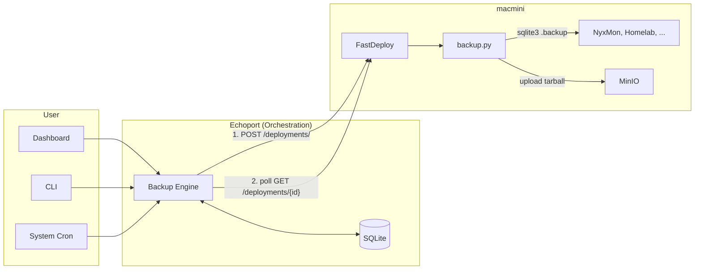
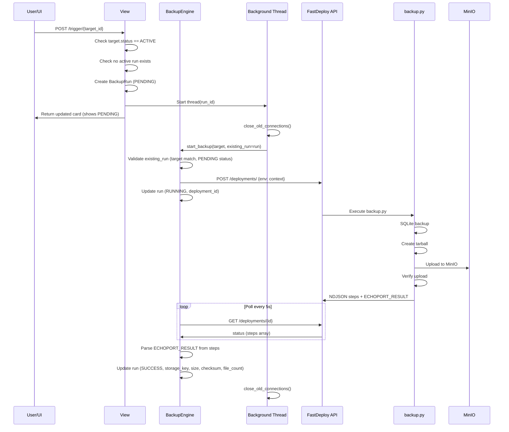

# Echoport - Backup Service PRD

**Status**: v1.0 (Phase 1 Complete)
**Date**: 2026-01-27
**Last Updated**: 2026-01-28 (Post-review implementation complete)

---

## Vision

Echoport is a backup orchestration service that:
1. Manages backups for homelab services (initially just Jochen)
2. Stores backups in MinIO (S3-compatible)
3. Integrates with FastDeploy for execution on remote hosts
4. Provides a simple dashboard for backup status and restore operations

---

## First Target: NyxMon

**Why NyxMon?**
- Simple backup needs (SQLite database)
- Django app (familiar stack)
- Already deployed via FastDeploy pattern

**What to back up:**
- `/home/nyxmon/site/db.sqlite3` - The database (critical)
- **Note**: `.env` file is NOT backed up (contains secrets). On restore, manually run `just deploy-one nyxmon` from ops-control to regenerate `.env` from secrets.

**Backup strategy:**
- **Safe SQLite backup**: Use `sqlite3 db.sqlite3 ".backup /tmp/backup.db"` (not file copy - avoids corruption on live DB)
- **Artifact format**: Single `.tar.gz` containing all backup files + `manifest.json`
- Store in MinIO with timestamp: `backups/nyxmon/20260127T020000.tar.gz`
- Retain: 7 daily, 4 weekly, 12 monthly (enforced by Echoport in Phase 4)

---

## Architecture Overview

**Key insight**: FastDeploy is the execution layer, Echoport is the orchestration layer.



**Why this split?**
1. FastDeploy already runs on macmini with subprocess execution infrastructure
2. Backup scripts run locally on the server (fast, direct MinIO access)
3. Echoport handles backup-specific concerns (scheduling, retention, restore UI)
4. Future multi-tenant needs (external users interact with Echoport, not FastDeploy)

**Integration flow:**
1. User clicks "Backup Now" or cron triggers scheduled backup
2. Echoport creates BackupRun (status=pending), DB constraint prevents concurrent backups
3. Echoport calls FastDeploy API: `POST /deployments/` with context `{ECHOPORT_TARGET: "nyxmon", ECHOPORT_DB_PATH: "/home/nyxmon/site/db.sqlite3"}`
4. FastDeploy runs `backup.py` on macmini
5. Script: safe SQLite backup → tarball with manifest → MinIO upload
6. Echoport polls `GET /deployments/{id}` every 5s until finished (timeout: 10min)
7. Echoport parses ECHOPORT_RESULT from step messages, updates BackupRun
8. Lock automatically released when run status changes from pending/running

**Note**: Retention cleanup runs separately in Phase 4 (not part of backup flow).

---

## Tech Stack (Decided)

| Component | Choice | Rationale |
|-----------|--------|-----------|
| **Backend** | Python/Django | Familiar, matches other projects |
| **Frontend** | HTMX + Django templates | Simple, proven in homelab |
| **Database** | SQLite (initially) | Simple, can migrate to PG later |
| **Storage** | MinIO (S3 API) | Already running, proven |
| **Scheduler** | System cron + Django management command | Simpler than APScheduler, avoids multi-worker issues with SQLite |
| **Execution** | FastDeploy API | Reuses existing infra, scripts run locally |
| **HTTP Client** | httpx (sync) | Simple, well-maintained |

**Scheduler note**: APScheduler with SQLite can have issues with multiple workers and job state persistence. Using system cron to call `python manage.py run_scheduled_backups` is simpler and more reliable for MVP. Can revisit with Celery+Redis if needed later.

**Scheduling deferred to Phase 2** - Phase 1 only supports manual backups via UI and CLI.

---

## Implementation Details (Phase 1)

### Key Design Decisions

| Decision | Rationale |
|----------|-----------|
| **Fully synchronous engine** | Avoids Django's `SynchronousOnlyOperation` error when mixing async/ORM. Background threads handle concurrency. |
| **ECHOPORT_RESULT in step message** | FastDeploy only parses valid JSON lines. Raw `ECHOPORT_RESULT:{json}` would be dropped. Embedding in step message ensures delivery. |
| **Minimal result payload** | FastDeploy truncates step messages at 4KB. Send only essential metadata (bucket, key, size, checksum, file_count). Full manifest stored in tarball. |
| **Root-owned service files** | Prevents privilege escalation. Fastdeploy user can execute but not modify script/config. |
| **Run created synchronously in view** | Avoids UI race condition where background thread hasn't created DB record before view queries it. |
| **existing_run parameter** | `start_backup(target, existing_run=run)` allows view to create run, thread to continue it. Single implementation, no duplication. |
| **close_old_connections()** | Background threads must manage DB connections explicitly to avoid leaks. |
| **All views require @login_required** | Prevents unauthorized access to dashboard and backup triggers. |

### Where Things Live (Phase 1)

| Component | Location | Purpose |
|-----------|----------|---------|
| **Backup role** | `ops-library/roles/echoport_backup/` | Ansible role that registers backup service with FastDeploy |
| **Backup script** | Deployed to `fastdeploy/services/echoport-backup/backup.py` via role | Self-contained backup logic |
| **Service config** | Deployed to `fastdeploy/services/echoport-backup/config.json` via role | FastDeploy service definition |
| **MinIO credentials** | Configured via role variables, mc alias on macmini | `echoport_backup_minio_*` vars |
| **Echoport** | `echoport/` Django app | Scheduling, history, UI, FastDeploy API client |

**Security hardening (ops-library role):**
- Directory, script, and config.json all owned by `root:root`
- Script mode `0755` (readable/executable by all, writable only by root)
- Sudoers uses `NOPASSWD:NOSETENV` to prevent environment manipulation

### Backup Script Output

The backup script emits progress via NDJSON to stdout:

```json
{"name": "init", "state": "running", "message": "Starting backup"}
{"name": "init", "state": "success", "message": "Configuration loaded for nyxmon"}
{"name": "backup", "state": "running", "message": "Creating backup"}
{"name": "backup", "state": "success", "message": "Backup created (2 files)"}
{"name": "upload", "state": "running", "message": "Creating archive and uploading"}
{"name": "upload", "state": "success", "message": "Uploaded 45,231 bytes"}
{"name": "verify", "state": "running", "message": "Verifying upload"}
{"name": "verify", "state": "success", "message": "Backup verified in MinIO"}
{"name": "result", "state": "success", "message": "ECHOPORT_RESULT:{\"success\":true,\"bucket\":\"backups\",\"key\":\"nyxmon/2026-01-28T02-00-00.tar.gz\",\"size_bytes\":45231,\"checksum_sha256\":\"abc123...\",\"file_count\":2}"}
{"event": "finish", "status": "success", "message": "Backup completed: backups/nyxmon/2026-01-28T02-00-00.tar.gz"}
```

**Note**: ECHOPORT_RESULT is embedded in the `result` step's message field. This ensures FastDeploy captures it (only valid JSON lines are parsed). The payload is kept small (~200 bytes) to avoid the 4KB message truncation limit.

### Backup Flow (Sequence)



---

## Data Model (Implemented)

```python
class BackupTarget(models.Model):
    """Source of truth for backup configuration."""

    name = models.CharField(max_length=100, unique=True)
    description = models.TextField(blank=True)
    fastdeploy_service = models.CharField(max_length=100)

    # What to back up
    db_path = models.CharField(max_length=500, blank=True)
    backup_files = models.JSONField(default=list, blank=True)

    # Scheduling (Phase 2)
    schedule = models.CharField(max_length=100, blank=True)  # Cron expression

    # Status
    status = models.CharField(max_length=20, choices=BackupStatus.choices, default="active")
    retention_days = models.PositiveIntegerField(default=30)
    timeout_seconds = models.PositiveIntegerField(default=600)

    # Storage
    storage_bucket = models.CharField(max_length=100, default="backups")


class BackupRun(models.Model):
    """Individual backup execution record."""

    target = models.ForeignKey(BackupTarget, on_delete=models.CASCADE, related_name="runs")
    status = models.CharField(max_length=20, choices=BackupRunStatus.choices, default="pending")
    trigger = models.CharField(max_length=20, choices=BackupTrigger.choices, default="manual")
    triggered_by = models.CharField(max_length=100, blank=True)

    # FastDeploy tracking
    fastdeploy_deployment_id = models.PositiveIntegerField(null=True, blank=True)

    # Result data
    storage_bucket = models.CharField(max_length=100, blank=True)
    storage_key = models.CharField(max_length=500, blank=True)
    size_bytes = models.BigIntegerField(null=True, blank=True)
    checksum_sha256 = models.CharField(max_length=64, blank=True)
    file_count = models.PositiveIntegerField(null=True, blank=True)

    # Error tracking
    error_message = models.TextField(blank=True)
    logs = models.TextField(blank=True)

    # Timestamps
    started_at = models.DateTimeField(default=timezone.now)
    finished_at = models.DateTimeField(null=True, blank=True)

    class Meta:
        ordering = ["-started_at"]
        constraints = [
            # Prevent concurrent backups for the same target
            models.UniqueConstraint(
                fields=["target"],
                condition=models.Q(status__in=["pending", "running"]),
                name="unique_active_backup_per_target",
            )
        ]
```

---

## MVP Scope

### Phase 1: Manual Backup ✅ COMPLETE

**ops-library (deployed to macmini via ops-control):**
- [x] Create `roles/echoport_backup/` Ansible role
- [x] Role deploys `backup.py` script to FastDeploy services directory
- [x] Role deploys `config.json` for FastDeploy service registration
- [x] Role configures MinIO credentials via mc alias
- [x] Security hardening: all files owned by root, NOSETENV in sudoers
- [ ] **TODO**: Run role via ops-control to register service on macmini

**echoport:**
- [x] Django project setup with uv (`pyproject.toml`, settings, etc.)
- [x] BackupTarget and BackupRun models with DB constraint for concurrent backup prevention
- [x] FastDeploy API client (`fastdeploy_client.py` - sync httpx)
- [x] Backup engine (`backup_engine.py` - synchronous orchestration)
- [x] CLI command: `python manage.py backup <target_name>`
- [x] HTMX dashboard with target cards, "Backup Now" button, auto-refresh during backup
- [x] Target detail page with run history
- [x] Run detail page with logs and error info
- [x] Development data command: `python manage.py create_devdata`
- [x] Basic test suite
- [x] Justfile for common commands (`just dev`, `just test`, etc.)
- [x] Authentication required on all views (`@login_required`)
- [x] Target status enforcement (only ACTIVE targets can be backed up)
- [x] file_count field for tracking number of files in backup

### Phase 2: Scheduled Backups (Next)

**echoport:**
- [ ] Add `croniter` dependency for cron expression evaluation
- [ ] Management command: `python manage.py run_scheduled_backups`
  - Uses `croniter` to check if each target is due based on `schedule` field
  - Tracks `last_scheduled_at` to prevent duplicate runs
- [ ] System cron: `*/5 * * * * cd /path/to/echoport && python manage.py run_scheduled_backups`
- [ ] Dashboard: show schedule, last run time, next run time
- [ ] Add tests for scheduled backup logic

### Phase 3: Restore

**fastdeploy:**
- [ ] Add restore action to backup service

**echoport:**
- [ ] RestoreRun model and tracking
- [ ] Restore button in UI with confirmation dialog
- [ ] Restore flow: select backup → trigger FastDeploy → monitor

### Phase 4: Polish

**echoport:**
- [ ] Retention policy enforcement (cleanup old backups from MinIO)
- [ ] Email notification on failure
- [ ] Add homelab as second backup target
- [ ] Show file_count in run detail UI

### Phase 5: ops-library Integration (Future)

**ops-library:**
- [ ] Extract backup logic into `echoport_backup_shared` role
- [ ] Create service-specific roles (`nyxmon_backup`, `homelab_backup`)

**ops-control:**
- [ ] Create playbooks for backup/restore

---

## Deployment Checklist

Before first backup can run:

1. [ ] **Deploy backup role** via ops-control to register service on macmini
2. [ ] **Configure MinIO credentials** in ops-control vars (`echoport_backup_minio_*`)
3. [ ] **Set FastDeploy service token** in echoport `.env` (`FASTDEPLOY_SERVICE_TOKEN`)
4. [ ] **Set FastDeploy base URL** in echoport `.env` (`FASTDEPLOY_BASE_URL`)
5. [ ] **Run migrations** on echoport (`python manage.py migrate`)
6. [ ] **Create superuser** (`python manage.py createsuperuser`)
7. [ ] **Create devdata** or manually add BackupTarget for nyxmon
8. [ ] **End-to-end test** backup flow
9. [ ] Deploy echoport to macmini (gunicorn + nginx)

---

## Questions Resolved

| Question | Decision |
|----------|----------|
| Push or pull? | **Pull via FastDeploy** - Echoport triggers, FastDeploy executes |
| Storage backend? | **MinIO** - already have it |
| Frontend framework? | **HTMX** - keeps it simple |
| Database? | **SQLite** initially |
| First target? | **NyxMon** - simple and valuable |
| Completion reporting? | **Polling** - Echoport polls FastDeploy every 5s, timeout 10min |
| Scheduler? | **System cron** - Phase 2, simpler than APScheduler |
| Retention ownership? | **Echoport** - Phase 4, backups accumulate until then |
| Artifact format? | **Tarball** - single `.tar.gz` with manifest.json |
| SQLite backup safety? | **sqlite3 .backup** - safe backup of live database |
| .env backup? | **Skip it** - recreate from ops-control secrets on restore |
| Async vs sync? | **Sync** - avoids Django SynchronousOnlyOperation errors |
| Result delivery? | **Step message** - ECHOPORT_RESULT embedded in step, avoids 4KB truncation |
| Manifest in result? | **No** - only file_count sent, full manifest in tarball |
| Script ownership? | **Root** - prevents privilege escalation |

---

## Open Questions for Later

1. **Multi-host**: Currently assuming macmini only. How to add other hosts?
2. **Backup verification**: How to verify a backup is actually restorable?
3. **Encryption at rest**: MinIO server-side encryption? Client-side?
4. **PostgreSQL backups**: For services like Mastodon - need `pg_dump` support
5. **Large file handling**: Media files for Mastodon/Jellyfin - incremental backups?

---

## Changelog

### v1.0 (2026-01-28)
- Phase 1 complete
- Sync engine (avoids SynchronousOnlyOperation)
- ECHOPORT_RESULT in step message (avoids FastDeploy dropping non-JSON)
- Minimal result payload with file_count (avoids 4KB truncation)
- Root-owned service files (prevents privilege escalation)
- All views require authentication
- Target status enforcement
- Defensive guards on existing_run parameter

### v0.7 (2026-01-27)
- Initial Phase 1 implementation
- Async engine (later changed to sync)
